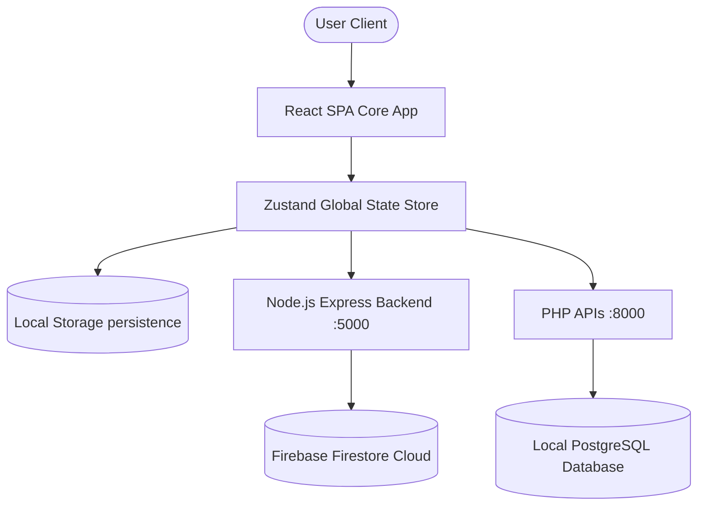

# EcoVerse - System Architecture

This document details the architectural layout, modules, state management, 3D WebGL renderer, and key design choices of the **EcoVerse** application.

---

## 🏗️ Architectural Overview

EcoVerse is built as a single-page React application powered by Vite, incorporating a local/remote Node.js backend (Express) and PHP API endpoints. It features client-side data persistence with fallback capabilities, dynamic 3D rendering (Three.js), and an interactive AI Coach chat interface.

---

## 📦 Key Component Breakdown

### 1. View Engine and State Management
- **React & TypeScript**: Frontend structure uses modular, type-safe functional components.
- **Zustand (`src/store/useStore.ts`)**: Manages the global state. Implements offline-first design:
  - Automatically loads and saves states (profile progress, quest checkmarks, chat logs) using Zustand's `persist` middleware inside `window.localStorage`.
  - Dynamically synchronizes state changes to Firestore when online.
  - Automatically intercepts local network requests in production to avoid CORS loopbacks.

### 2. Carbon Footprint Engine
- Calculates direct and indirect emissions using the sustainable coefficients defined by the UN IPCC target budget (8.0 kg CO₂e/day limit):
  - **Scope 1 (Direct)**: Transportation commute (Gas Car, EV, Public Transit, Walk/Bike) and home heating.
  - **Scope 2 (Indirect - Energy)**: Home size grid power consumption multiplied by source coefficients.
  - **Scope 3 (Indirect - Other)**: Nutritional diet choices, retail purchases, recycling rates, and financed capital bank portfolios.

### 3. Interactive WebGL Biosphere (`src/components/ThreeDPlanet.tsx`)
- Renders a procedurally generated 3D miniature Earth using **Three.js** inside a canvas container:
  - Core soil texture color updates dynamically, transitioning from dry brown to fertile green based on the user's total active experience points (XP).
  - Flora biomes grow clusters of trees matching the quantity of completed milestones/achievements.
  - Orbiting rings grow in particle density as more achievements are unlocked.

### 4. Context-Aware AI Coach (`server.js` & `AICoachView.tsx`)
- Integrates a context-aware chat bot interface. The client forwards the user's active baseline twin profile to the AI router. The bot computes the exact footprint split, references the Sustainable target budget of 8.0 kg, identifies the highest emitter category, and explains the logical reduction reasoning.

---

## 💾 Design Decisions

- **Lazy Loading**: Views are dynamically split and loaded via React Suspense to minimize initial chunk loads and accelerate first paint.
- **Radial gradients & Glassmorphism**: Visual panels use backdrop filters (`backdrop-blur-md`) and custom HSL gradients to maintain a premium, state-of-the-art sustainability theme.
- **Offline Fallbacks**: Every backend API (Direct Messages, community feed, AI chat) has a robust local storage/in-memory mock fallback to guarantee 100% application uptime.
