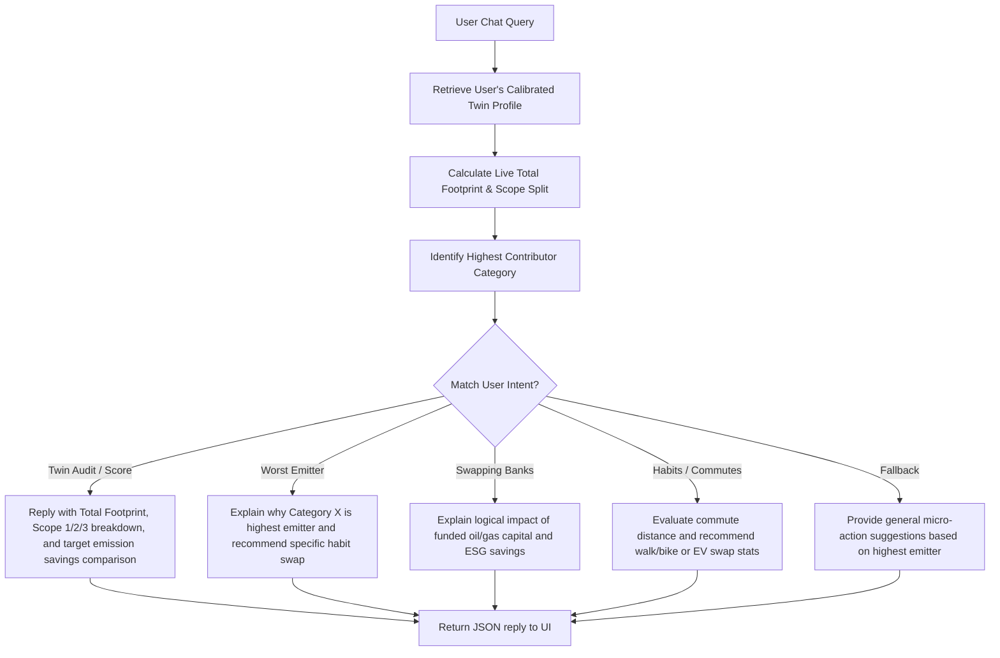

# EcoVerse - Dynamic Carbon Twin & AI Coach Platform

EcoVerse is an advanced gamified sustainability platform designed to automatically measure, analyze, calibrate, and reduce an individual's carbon footprint. It features an interactive **3D WebGL miniature planet** (rendered dynamically using Three.js) and a context-aware **AI Climate Coach** chatbot.

---

## 📸 Application Screenshot Placeholders


*Placeholder: Premium Glassmorphism Dashboard displaying Carbon Twin Calibration, XP progressions, and the procedurally generated 3D earth.*

---

## 🎯 Chosen Challenge Vertical & Persona

- **Challenge Vertical**: Daily Commute & Lifestyle Optimization for Urban Professionals (The Smart Commuter)
- **Target Persona**: **Alex, the Tech-Savvy Urbanite** (28 years old, hybrid worker, commutes by gas car occasionally, buys average retail, and banks conventionally). Alex wants to audit and offset carbon emissions through simple daily actions without dealing with complex calculations or static spreadsheets.

---

## ⚠️ Problem Statement

Urban professionals generate high direct (commuting, heating) and indirect (nutritional diet, banking financed capital) emissions. They are often unaware of their highest contributors (Scope 1, 2, and 3 split) or how to target them. Traditional carbon tools rely on static tables, offering no real-time gamified incentive or contextual guidance.

---

## 🧠 AI Logic & Decision Flow

The AI Coach chatbot is context-aware and computes personalized responses on the fly:



---

## ✨ Features

1. **Carbon Twin Calibration**: Sliders and dropdowns to dynamically model commuting transit, dietary habits, home power mixes, shopping habits, and bank selections.
2. **Interactive 3D WebGL Biosphere**: Procedures growing tree clusters and dynamic soil states based on active XP rewards.
3. **AI Carbon Coach Dialog**: Context-aware chat bot interface evaluating twin configurations, computing emissions, comparing against the sustainable budget (8.0 kg/day limit), and returning reduction strategies.
4. **Community Feed & Direct Messages**: Warden networking feed, comment/applause system, and direct transmissions with image/video attachments.
5. **Cosmetic Marketplace Store**: Purchase avatar frames, glowing background themes, and elite warden badges using virtual Eco Coins.
6. **Robust Testing & Clean Linting**: Verified Vitest suite and ESLint configurations.

---

## ⚙️ Technology Stack & Architecture

- **Frontend**: React SPA (TypeScript), Vite, Zustand, Recharts, Framer Motion, Three.js (WebGL).
- **Backend Services**: Node.js (Express), PHP APIs.
- **Databases**: Firebase Firestore (Cloud), PostgreSQL (Local).
- **Asset Split**: Views dynamically chunked and lazy-loaded via React Suspense fallback modules.

---

## 🚀 Installation & Local Setup

### Prerequisites
- Node.js (v18+) and npm installed.

### Setup Guide
1. Clone the repository and install dependencies:
   ```bash
   npm install
   ```
2. Configure Environment:
   - Copy [`.env.example`](file:///c:/Users/AstroCluster/Desktop/physics/.env.example) to `.env` and fill in your details.
3. Launch development workspace:
   ```bash
   npm run dev
   ```
   *This starts both the Node Express server (port 5000) and the Vite development server in parallel.*
4. Open the local address (typically `http://localhost:5173`) in your web browser.

---

## 📋 Assumptions

- **UN IPCC Sustainable Budget**: Daily target of **8.0 kg CO₂e** is assumed based on pathways to limit warming to 1.5°C by 2030 (scaled down to daily individual targets).
- **Emissions coefficients**: Values represent standard daily averages ($kg\ CO_2e$) for transportation modes, dietary choices, home sizes, retail manufacturing, and financed commercial banking capitals.

---

## 🔮 Future Improvements

1. **Automatic GPS Commute Log**: Auto-calculate transportation distance commute segments using cell telemetry.
2. **Receipt Parsing AI**: Scan shopping invoices to extract detailed consumer retail Scope 3 indicators.
3. **OAuth Integrations**: Support native Google OAuth logins for wardens.
